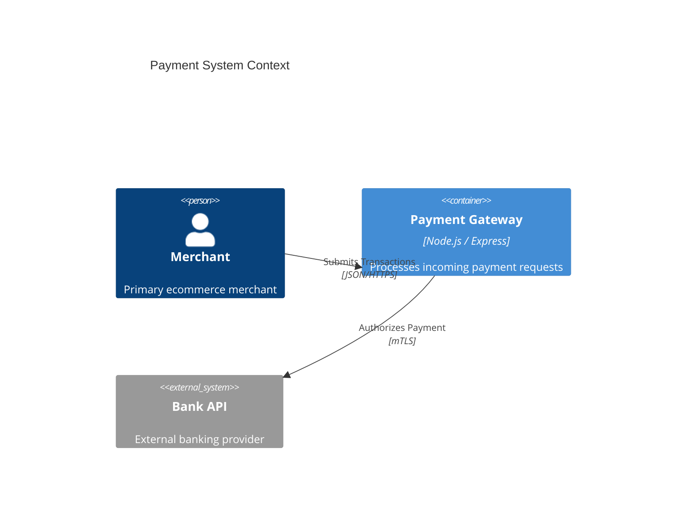

# diag2md

> Convert Draw.io ([diagrams.net](https://app.diagrams.net)) [C4 architecture diagrams](https://c4model.com) (`.xml` or `.drawio` files) into clean [Mermaid](https://mermaid.js.org) Markdown format.

[](https://www.npmjs.com/package/diag2md)
[](https://github.com/diag2md/diag2md/blob/main/LICENSE)

`diag2md` is a lightweight CLI application and TypeScript/Node.js library that parses Draw.io diagram files—including multi-page and deflated/compressed XML diagrams—and outputs valid Mermaid Markdown diagrams ready to render in GitHub, GitLab, Notion, or documentation sites.

---

## Features

- 🎯 **Full C4 Model Support**: Converts `Person`, `Person_Ext`, `System`, `System_Ext`, `SystemDb`, `Container`, `ContainerDb`, `Component`, `System_Boundary`, and relationship edges.
- 📦 **Decompresses & Parses Draw.io Files**: Seamlessly handles raw uncompressed XML and base64/zlib-deflated `.drawio` file contents.
- 📄 **Multi-Page Diagram Support**: Automatically extracts and parses diagram pages in multi-page Draw.io files.
- 🛠️ **CLI & Programmatic API**: Use instantly via `npx diag2md` or import into TypeScript/JavaScript projects.
- ⚡ **TypeScript First**: Ships with full ES modules, CommonJS support, and bundled `.d.ts` type definitions.

---

## Quick Start

### Run directly via `npx` (No installation needed)

```bash
npx diag2md -i architecture.drawio -o diagram.md
```

### Global Installation

```bash
npm install -g diag2md

# Convert and save output to markdown file
diag2md -i architecture.drawio -o diagram.md

# Convert and output directly to terminal stdout
diag2md -i architecture.drawio
```

### Local Project Installation

```bash
npm install diag2md
```

---

## CLI Reference & Options

```text
Usage: diag2md [options]

Convert Draw.io C4 architecture diagrams into Mermaid Markdown

Options:
  -V, --version        output the version number
  -i, --input <path>   Input Draw.io (.xml / .drawio) file (Required)
  -o, --output <path>  Output Mermaid (.md) file (Optional; stdout if omitted)
  -t, --type <type>    Diagram type: 'c4' or 'uml' (default: "c4")
  -h, --help           display help for command
```

### Options Table

| Option | Alias | Description | Required | Default |
| --- | --- | --- | --- | --- |
| `--input <path>` | `-i` | Path to input Draw.io diagram file (`.xml` or `.drawio`) | **Yes** | — |
| `--output <path>` | `-o` | Path to save generated [Mermaid](https://mermaid.js.org) Markdown (`.md`) file | No | `stdout` |
| `--type <type>` | `-t` | Type of diagram conversion (`'c4'` or `'uml'`) | No | `'c4'` |
| `--version` | `-V` | Output application version number | No | — |
| `--help` | `-h` | Display command help and available flags | No | — |

---

## Programmatic API

### Basic Usage

```typescript
import { convertC4ToMermaid } from "diag2md";

const xmlContent = `<mxfile>...</mxfile>`;
const mermaidMarkdown = convertC4ToMermaid(xmlContent);

console.log(mermaidMarkdown);
```

### Advanced Controller Usage

```typescript
import { ConverterController } from "diag2md";

const controller = new ConverterController({
  input: "path/to/diagram.drawio",
  output: "path/to/output.md",
  type: "c4",
});

const markdown = controller.execute();
```

---

## Draw.io Authoring Guidelines for C4 Diagrams

To ensure accurate XML parsing and valid Mermaid C4 output, follow these key guidelines when creating your diagrams in Draw.io (diagrams.net):

1. **Properly Connect Relationships (Arrows & Connectors)**
   - Always snap relationship arrows directly to the connection points of source and target shapes.
   - Unconnected or floating arrows will not establish `source` and `target` cell references in the underlying XML, which prevents relationship edges from being converted.
   - 📖 *Guide*: [Draw.io Connectors & Connection Points](https://www.drawio.com/doc/faq/connector-styles)

2. **Group Boundaries & Containers (Parent-Child Hierarchy)**
   - Place elements (such as Containers, Databases, or Components) directly inside System or Container Boundary shapes.
   - Ensure boundary shapes act as container shapes in Draw.io so the parent-child hierarchy is recorded in the XML structure and properly translated into Mermaid `System_Boundary` blocks.
   - 📖 *Guide*: [Draw.io C4 Modelling & Boundaries](https://drawio-app.com/blog/taming-large-diagrams-for-a-more-streamlined-overview/)

3. **Use Built-in C4 Shapes**
   - Enable the built-in C4 shape library in Draw.io (**More Shapes... → Software → C4**) or open Draw.io with C4 shapes preloaded.
   - 📖 *Resource*: [Open Draw.io with C4 Shapes Preloaded](https://www.drawio.com/blog/c4-modelling)

---

## Example Output

Given a C4 Draw.io diagram file, `diag2md` generates standard Mermaid syntax:

````markdown

````

---

## Development & Contributing

```bash
# Clone repository
git clone https://github.com/diag2md/diag2md.git
cd diag2md

# Install dependencies
npm install

# Build compiled bundles to dist/
npm run build

# Run unit test suite
npm run test
```

---

## License

[MIT](LICENSE) © polymatic.ventures
